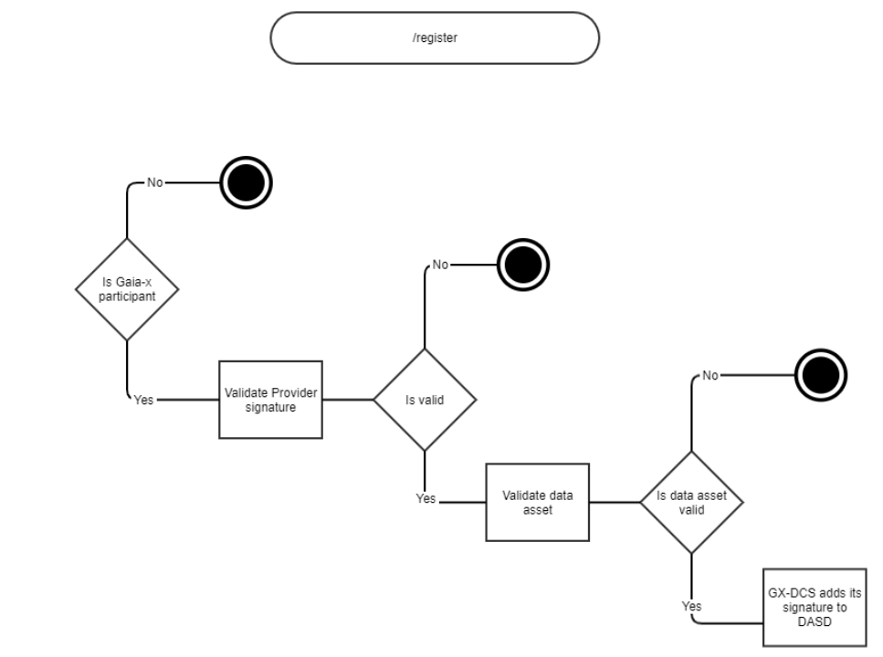
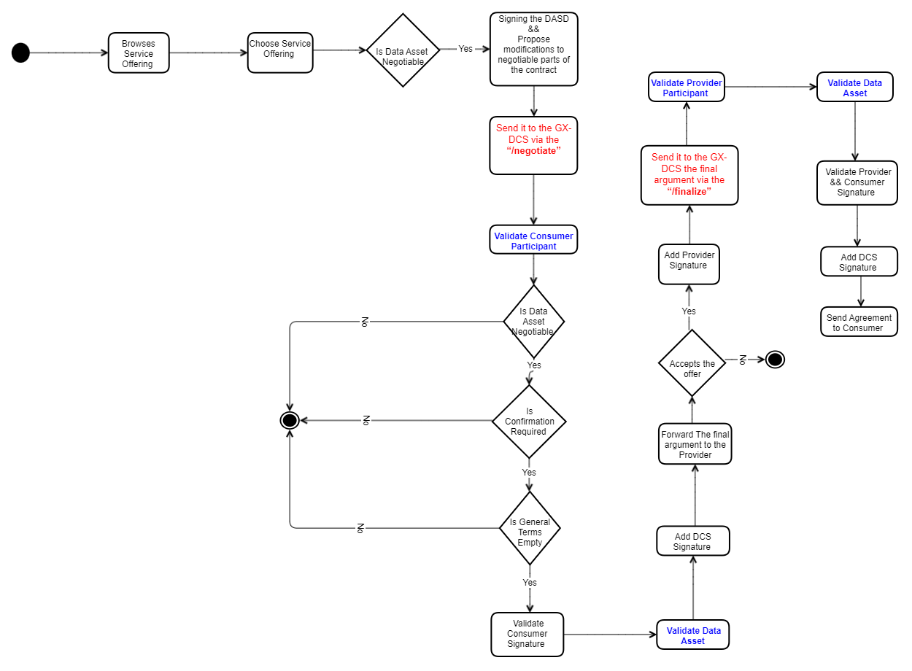
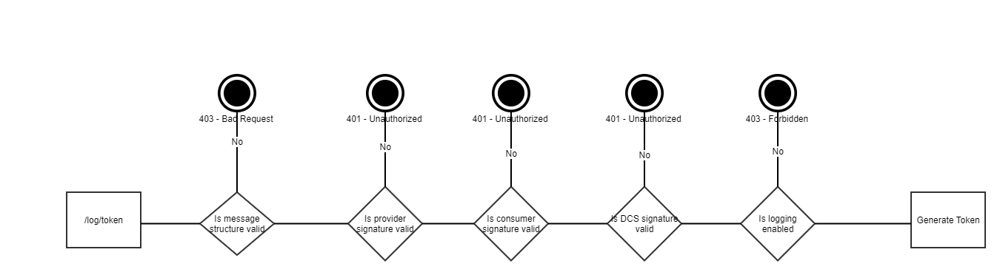

# DataExchange

## Introduction
DataExchange is a project designed to facilitate the exchange of data between different systems and services. The primary objective is to provide a robust and scalable solution for data transfer, ensuring data integrity and security throughout the process.
## Definitions and Vocabulary

| **Term**              | **Description**                                                                                                                                                                                                 |
|-----------------------|-----------------------------------------------------------------------------------------------------------------------------------------------------------------------------------------------------------------|
| **Data**              | Any digital representation of acts, facts or information and any compilation of such acts, facts or information.                                                                                                |
| **Data Product**       | A collection of one or more data that are packaged by the Data Provider and made ready for Data Exchange.                                                                                                        |
| **Data Provider**      | A participant that acquires the right to access and use some data and that makes Data Products available.                                                                                                       |
| **Data Catalog**       | A Data Catalogue presents a set of available Data and Data Products that can be queried.                                                                                                                        |
| **Data Consumer**      | A participant that receives data in the form of a Data Product. The data is used for query, analysis, reporting or any other data processing.                                                                    |
| **Data Exchange Services** | A set of services that provides features enabling a Data Exchange, such as and not limited to: policy negotiation for access control and usage control, exchange traceability, service protocol negotiation, data access, data tiering, access enforcement, usage enforcement.   **Note**: Data Connector or Data Exchange Platform are two different architecture implementations of potentially similar Data Exchange service features. |

## Product Perspective
GX-DCS is a stateless microservice providing backend logic with a few interfaces and a minimal GUI, without any database, except for local caching. It relies on several Gaia-X Federation Services (GXFS) to support a data ecosystem:

- **Gaia-X Federated Catalogue (GX-FC)**: This is where Data Providers publish Data Asset Self-Descriptions (SDs). GX-FC expects Data Providers to operate an endpoint for subscribing to these SDs.
- **Gaia-X Portal**: This frontend allows browsing, searching, and comparing Gaia-X assets. It mainly functions as a GUI for GX-FC, gathering all its information from there.
- **Gaia-X Trust Service**: Provides functionality for validating signatures, resolving DIDs, and retrieving public keys of Participants. It's essential for verifying identities within Gaia-X.
- **Gaia-X Data Exchange Logging Service (GX-DELS)**: Complements GX-DCS by handling data transaction logs for billing, monitoring, and auditing. GX-DELS requires valid Log Tokens, which are issued by GX-DCS.

## Product Functions

| **Endpoint**              | **Description**                                                                                                                                                                                                 |
|-----------------------|-----------------------------------------|
| **/register**              | Data Asset Registration|
| **/make/contract**       | Making a Contract|
| **/negotiate**      | Contract Negotiation|
| **/finalize**       | Finalization of a Contract|
| **/validate**      | Contract Validation                                               |
| **/log/token** | Get Log Token|

 ### /register
API for Data Asset Registration Register contract API

**<ins>Data Asset Registration API:</ins>** Every Data Provider must register a Data Asset through an API ("/register").

**<ins>Self-Description Specification:</ins>** All elements of the Data Asset Self-Description must be definable during the registration process

**<ins>Negotiable Properties:</ins>** If placeholders are used, these must be marked as negotiable by setting the gax:negotiable property to true in any Rule containing a placeholder.

**<ins>Steps:</ins>**
   - Verify that users are GX Participants before allowing them to register a Data Asset.
   - Check the properties named "gax:negotiable" to true in each Rule that contains a placeholder.
   - Check with the GX-FC if the Self-Description is formally correct.
   - If the validation of the Data Asset Self-Description and the providers signature were correct, the GX-DCS MUST add its signature to the Data Asset Self-Description using a hash that includes the signature of the Data Provider and send the resulting signed SD back to the Data Provider (for both interfaces).

**<ins>Missing implementation:</ins>**

The Check with the GX-FC if the Self-Description is formally correct.

### /make/contract
API for validating the format and content of the DASD and sign it by the DSC.

**<ins>Steps:</ins>**
   - GX-DCS confirms the Consumer s identity and the provided details and finalizes the Data Contract by replacing the previous GX-DCS Signature with a new version now calculated over all details in the finale contract.
   - Validate the provider signature
   - Verify that the consumer is GX participants
   - Validate the consumer signature
   - Check with the GX-FC if the Self-Description is formally correct.
   - Check if the DASD is non-negotiable
   - Check if there is no confirmation requirement
   - Check if there is no confirmation requirement

**<ins>Missing implementation:</ins>**

1. Transfer Contract: 
This could be used to automatically evaluate Agreements or to establish manual Confirmation flows on the Provider side.
    - The Providers need to offer an endpoint (that the GX-DCS can transfer contract offers to) utilizing the property "gax:hasLegallyBindingAddress" in their Self Descriptions.
    - MUST forward the Agreement to the Data Provider and MUST inform the Data Consumer about it.
2. The Check with the GX-FC if the Self-Description is formally correct.

### /log/token

The GX-DCS offers an endpoint for getting a Log Token. It returns a Log Token if the submitted finalized Agreement is valid.
- The prerequisite for that is a valid finalized Agreement which contains optional or mandatory logging.
- The GX-DCS evaluates the finalized Agreement and returns whether a finalized Agreement is valid or not, including a humanreadable explanation by validating the signature of the **provider**, **consumer** and the **DCT**.
- Returns a Log Token which authenticates access at GX-DELS

### /negotiate
**<ins>API for Negotiating Agreements:</ins>** The Data Contract negotiation process is done through the endpoint: "/negotiate".

**<ins>Triggering Negotiation:</ins>** It must be possible to initiate the Agreement negotiation via the API. The Data Consumer must send the Agreement to trigger this request.

**<ins>Interacting Parties:</ins>** The GX-DCS must interact with the Provider’s endpoint for confirmation, the Data Consumer (requester), and the Federated Catalogue during the negotiation process.

**<ins>Consumer Signature Requirement:</ins>** Consumer Signature Requirement: The Data Consumer must sign the completed Data Asset Self-Description (with Consumer details and placeholders filled) before submitting the request.

**<ins>Forwarding the Agreement:</ins>** If the Agreement passes all checks, the GX-DCS must forward it to the Data Provider.

**<ins>Provider’s Decision:</ins>** The Data Provider decides whether to accept or decline the Agreement. If accepted, the Provider proceeds to the /finalize endpoint. If declined, the Data Provider must inform the Data Consumer.

| **Input** |**Ouptut**                                                                                                                                                                                            |
|--------------------------------------|-----------------------------------------|
| Agreement signed by the Data Consumer| Confirmation that the Agreement was forwarded to the Data Provider.|

 **Steps**:

The Data Provider invites Data Consumers to make contract offers by sharing the Data Asset Self-Description (DASD) (The contract cannot be finalized until the Data Provider actively confirms the offer)

1- Consumers, in this case, submit offers by adding their Consumer Details and signing the DASD (Can also propose modifications to negotiable parts of the contract, if allowed.)

2- GX-DCS verify that users are GX participants, validate the format and signature

3- GX-DCS send the data assest after adding his signature 

### /finalize

**<ins>API for Finalizing Agreements:</ins>** The Agreement finalization process is done through the endpoint: "/finalize". This step is required for Agreements negotiated via the "/negotiate" endpoint.

**<ins>Request from Data Provider:</ins>** The Data Provider must send a request to the /finalize endpoint, containing the Agreement signed by both the Data Provider and the Data Consumer.
    
**<ins>Signature Validation:</ins>** The GX-DCS must validate the signatures of both the Data Provider and the Data Consumer before proceeding with finalization.

**<ins>Finalizing the Agreement:</ins>** Once both signatures are validated, the GX-DCS must sign the Agreement, including the signatures of the Data Provider and Data Consumer in the hash.
    
**<ins>Distribution of Finalized Agreement:</ins>** After signing, the GX-DCS must send the finalized Agreement to both the Data Provider and the Data Consumer.

| **Input** |**Ouptut**                                                                                                                                                                                            |
|--------------------------------------|-----------------------------------------|
|Agreement (Signed by Data Provider and Data Consumer) | Finalized Agreement (Signed by Data Provider, Data Consumer and GX-DCS)|

 **Steps**:

1- If the Data Provider accepts the offer, they sign the contract using the /finalize endpoint, including their signature over all relevant details 

2- GX-DCS verify that users are GX participants, validate the format and both signature

3- GX-DCS adding his signature over all content and inform consumer

### /validate

**<ins>API for Validating Agreements:</ins>** The validation of finalized Agreements is handled via the endpoint: "/validate".

**<ins>Differentiation Between Agreement Types:</ins>**
    1. A negotiable Agreement has one or more gax:negotiable properties or the gax:confirmationRequired property set to true.
    2. A non-negotiable Agreement has all gax:negotiable properties set to false.
    
**<ins>Signature Verification:</ins>** The GX-DCS must verify the signatures of the finalized Agreement:
    1. GX-DCS signature
    2. Consumer signature
    3. Provider signature

**<ins>Provider Signature in Non-Negotiable Agreements:</ins>** For non-negotiable Agreements, the validation of the Provider’s signature must be done by removing the Consumer’s information before validation.

**<ins>Validation Responsibility:</ins>** The GX-DCS is responsible for validating the finalized Agreement.

| **Input** |**Ouptut**                                                                                                                                                                          |
|--------------------|-------------------------------------|
|Finalized Agreement | Validity of the finalized Agreement |

## Acitvity diagram 

### Useful Diagram
#### Validate Participant
Validate Participant: This diagram illustrates the steps for validating a participant:

- The participant information is retrieved from the Trust Service.
- It then checks if the participant exists. If not, the process ends.
- If the participant exists, it checks whether the participant's status has been revoked. If revoked, the process stops. If not, the validation continues.

#### Validate Data Asset
Validate Data Asset: This diagram describes the process of validating a data asset:

- The process begins by retrieving the original data asset from the Federated Catalog.
- It then checks if the data asset is valid. If the asset is invalid, the process terminates.
- If valid, it verifies whether the data asset is supported. If the asset is unsupported, the process stops. Otherwise, the process continues.

#### Validate Final Contract 
Validate Contract: The diagram outlines a contract validation process with four key validation steps:

- First, it checks if the contract structure is valid. If not, the process stops.
- Second, it validates the consumer's signature. If the signature is invalid, the process stops.
- Third, it validates the provider's signature, with a similar exit condition for failure.
- Finally, it checks the validity of the Data Contract Service (DCS) signature. If all signatures and structure are valid, the process continues; otherwise, it terminates.

### Register Data Asset Contract

### Process Overview

1. **Verify Provider's GX Participation:**
   - Send a GET request to check if the provider is a GX Participant (using mock data for now).
   - If the provider is not a GX Participant, terminate the process and return an "unauthorized" exception.

2. **Validate Provider's Signature:**
   - If the provider is a GX Participant, validate their signature.
   - If the signature is invalid, terminate the process and return an "unauthorized" exception.

3. **Check Self-Description with GX-FC:**
   - If the signature is valid, verify with GX-FC that the provider’s Self-Description is formally correct.

4. **Add GX-DCS Signature to Self-Description:**
   - If the Self-Description is correct, the GX-DCS must add its signature to the Data Asset Self-Description.

---

Afterwards, a contract can be established in two different ways: 
### Make Non Negociable Contract
The Data Providers offer a Data Asset “as is” only based on the DASD and allow each valid GX-DCS to finalize the Data Contract on their behalf:

- Data Consumers can either access GX-FC’s API directly to search, filter available Data Asset SDs, or they can make use of the Gaia-X Portal, which accesses GX-FC behind the scenes and provides a neat GUI for browsing Data Asset SDs
- The Data Consumer begins by adding their Consumer Details to the Data Asset Self-Description (DASD) and signs the contract with a Consumer Signature. (The contract already contains the Provider Details and Contract Details, which were signed earlier by the Data Provider and verified by the GX-DCS with a DCS Signature)
- Once the Consumer adds their signature, the GX-DCS validates both the Provider and Consumer signatures, along with all other contract details. If everything is correct, the GX-DCS finalizes the agreement by updating its DCS Signature, confirming the contract’s validity. This final step completes the contract, ensuring that all involved parties and details are properly validated.
- The entire process is conducted via the /make/contract endpoint.

### Make Negociable Contract
In this scenario, the Data Provider invites Data Consumers to make contract offers by sharing the Data Asset Self-Description (DASD). However, the contract cannot be finalized until the Data Provider actively confirms the offer. The Data Provider sets the gax property in the DASD to ensure they have the final say in accepting or rejecting any offer.  
- Consumers, in this case, may submit offers by adding their Consumer Details and signing the DASD. They can also propose modifications to negotiable parts of the contract, if allowed. 
- The signed offer is then submitted via the /negotiate endpoint to the GX-DCS, which verifies the changes against the original DASD, ensuring only negotiable properties were modified.
- If the Data Provider accepts the offer, they sign the contract using the /finalize endpoint, including their signature over all relevant details. 
- The GX-DCS then validates the entire contract, ensuring both parties have confirmed and signed it. Once validated, the GX-DCS adds its signature, finalizing the contract and distributing the fully executed agreement to all parties involved.

### Token Generation Process

1. **Validate Provider's Signature:**
   - If the provider is a GX Participant, validate their signature.
   - If the signature is invalid, terminate the process and return an "unauthorized" exception.

2. **Validate Consumer's Signature:**
   - Validate the consumer's signature.
   - If the signature is invalid, terminate the process and return an "unauthorized" exception.

3. **Validate Data Contract Service Signature:**
   - Validate the Data Contract Service (DCS) signature.
   - If the signature is invalid, terminate the process and return an "unauthorized" exception.

4. **Check if Logging is Enabled:**
   - Determine if the logging attribute is enabled.

5. **Generate Token:**
   - Generate a token for the validated data asset.

