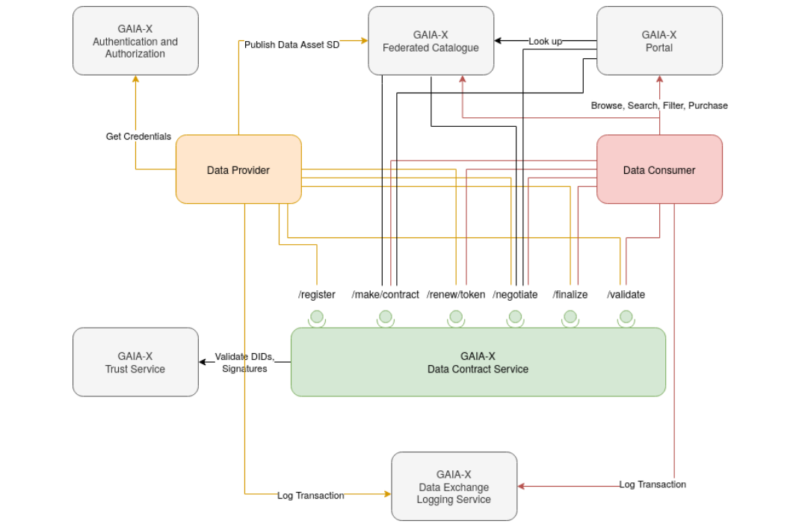

# Data Exchange

## Introduction
DataExchange is a project designed to facilitate the exchange of data between different systems and services. The primary objective is to provide a robust and scalable solution for data transfer, ensuring data integrity and security throughout the process.
## Definitions and Vocabulary

| **Term**              | **Description**                                                                                                                                                                                                 |
|-----------------------|-----------------------------------------------------------------------------------------------------------------------------------------------------------------------------------------------------------------|
| **Data**              | Any digital representation of acts, facts or information and any compilation of such acts, facts or information.                                                                                                |
| **Data Product**       | A collection of one or more data that are packaged by the Data Provider and made ready for Data Exchange.                                                                                                        |
| **Data Provider**      | A participant that acquires the right to access and use some data and that makes Data Products available.                                                                                                       |
| **Data Catalog**       | A Data Catalogue presents a set of available Data and Data Products that can be queried.                                                                                                                        |
| **Data Consumer**      | A participant that receives data in the form of a Data Product. The data is used for query, analysis, reporting or any other data processing.                                                                    |
| **Data Exchange Services** | A set of services that provides features enabling a Data Exchange, such as and not limited to: policy negotiation for access control and usage control, exchange traceability, service protocol negotiation, data access, data tiering, access enforcement, usage enforcement.   **Note**: Data Connector or Data Exchange Platform are two different architecture implementations of potentially similar Data Exchange service features. |

## Product Perspective
GX-DCS is a stateless microservice providing backend logic with a few interfaces and a minimal GUI, without any database, except for local caching. It relies on several Gaia-X Federation Services (GXFS) to support a data ecosystem:

- **Gaia-X Federated Catalogue (GX-FC)**: This is where Data Providers publish Data Asset Self-Descriptions (SDs). GX-FC expects Data Providers to operate an endpoint for subscribing to these SDs.
- **Gaia-X Portal**: This frontend allows browsing, searching, and comparing Gaia-X assets. It mainly functions as a GUI for GX-FC, gathering all its information from there.
- **Gaia-X Trust Service**: Provides functionality for validating signatures, resolving DIDs, and retrieving public keys of Participants. It's essential for verifying identities within Gaia-X.
- **Gaia-X Data Exchange Logging Service (GX-DELS)**: Complements GX-DCS by handling data transaction logs for billing, monitoring, and auditing. GX-DELS requires valid Log Tokens, which are issued by GX-DCS.

## Data Contract Transaction Overview
The data contract transaction process involves several key stakeholders—Data Consumer, Data Provider, and the Data Contract Service. Each party plays a specific role in the lifecycle of a contract, from the registration of a service offering to the validation and signing of the final agreement. Below, we illustrate two distinct contract transaction types: a negotiable contract and a non-negotiable contract.
### Making Non negotiable Contract
For non-negotiable contracts, the process is simplified. The Data Consumer directly chooses and signs the service offering without the possibility of modifications. The Data Contract Service then validates the final contract and signs it.

### Making negotiable Contract
In this case, the Data Consumer can choose a service offering and propose modifications. Once the Data Contract Service receives the modified offer, they forward the final agreement to the Data Provider. After the Data Provider accepts the offer, they send the argument with their signature. The Data Contract Service then validates and signs the arguments.

### Missing Implementation 
Currently, the Data Contract Transaction (DCT) relies on two key external services: the **Trusted Service** and **the Federated Catalogue**. These components play a critical role in ensuring secure and valid interactions:

- Trusted Service: The DCT uses the Trusted Service to validate that the requester is a Gaia-X Participant, ensuring that only authorized entities are involved in the transaction.

- Federated Catalogue: The DCT interacts with the Federated Catalogue to validate the Data Asset by comparing it with the original Data Asset registered in the FC. This ensures the integrity and authenticity of the Data Asset throughout the transaction.

At present, both the Trusted Service and Federated Catalogue interactions are mocked, meaning the DCT makes mock calls to simulate the behavior of these services during development. Full integration with these services will be implemented in future updates.

## Data Exchange Logging Overview
After a contract has been agreed upon and has been signed by both parties, data transmission from the Data Provider to the Data Consumer can commence. 

The contract negotiation can lead to both sides agreeing on a logging service which is then used by both sides to log data transactions. 

