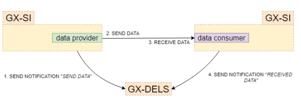

# Data Exchange Logging

## Introduction
The Gaia-X Data Exchange Logging Service (GX-DELS) will improve data traceability and contract negotiation by creating a logging service that can be used by the GX-DCS to guarantee lossless and auditable logging.
Every data transaction within Gaia-X consists of the following parts:

After a contract has been agreed upon and has been signed by both parties, data transmission from the Data Provider to the Data Consumer can commence. The contract negotiation can lead to both sides agreeing on a logging service (this document) which is then used by both sides to log data transactions. The GX-DELS provides features to enable integrity and access protected logging in a decentralized manner for both parties.

## Product Perspective
GX-DELS is a stateless microservice. It Complements GX-DCS by handling data transaction logs for billing, monitoring, and auditing. GX-DELS requires valid Log Tokens, which are issued by GX-DCS.

## Product Functions

The two main functions of the Gaia-X Service Instance (GX-SI) GX-DELS are
    -   Log Notifications into the GX-DELS Inbox: Data Provider and Data Consumer can send notifications on events to the GX-DELS Inbox including a logging token to verify the existence of a contract.
    -   Query Log Notifications from GX-DELS Inbox: Data Provider and Data Consumer can query Log  Notifications from the GX-DELS. 3rd eligible parties can be enabled to query information from the GX-DELS.

The following figure provides an overview of the main functionality of GX-DELS:

| **Endpoint**              | **Method** |**Description**                                                                                                                                                                                                 |
|-----------------------|----------|-----------------------------------------|
| **/inbox**             | GET | Query notifications from the GX_DELS inbox based on filters |
| **/inbox/{notification_id}**       | GET | get the details of a notification |
| **/inbox**      | POST | The consumer and the provider can notify each other |

 ### /inbox :GET

